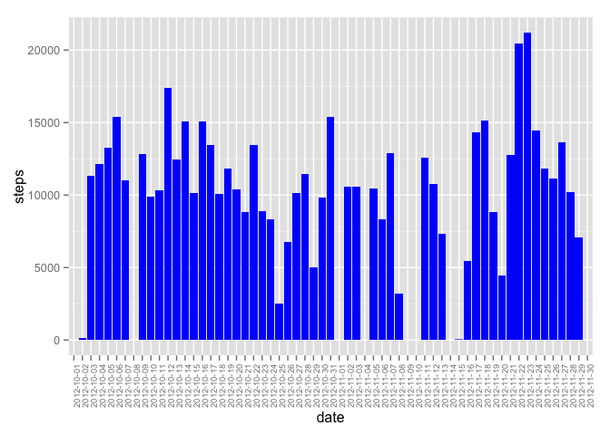
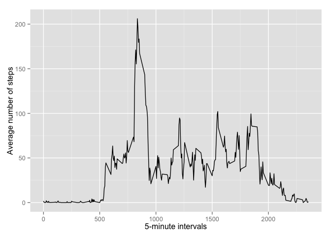

# Reproducible Research: Peer Assessment 1

Load the necesary libraries

```r
#Is necesary install before ggplo2
#install.packages("ggplot2")
library(ggplot2)
```

## Loading and preprocessing the data

Unzip the activity.zip file

```r
unzip("activity.zip")
```
Read de activy.csv file and show the head of the data

```r
data <- read.csv("activity.csv")
head(data)
```

```
##   steps       date interval
## 1    NA 2012-10-01        0
## 2    NA 2012-10-01        5
## 3    NA 2012-10-01       10
## 4    NA 2012-10-01       15
## 5    NA 2012-10-01       20
## 6    NA 2012-10-01       25
```
## What is mean total number of steps taken per day?

1. Calculate the total number of steps taken per day and set the names of the data columns

```r
stepsByDay <- aggregate(data$steps, by=list(data$date), FUN=sum)
names(stepsByDay) <- c('date','steps')
```
2. Make a histogram of the total number of steps taken each day

```r
ggplot(data = stepsByDay, aes(x = date, y = steps)) +
geom_histogram(stat = "identity", fill="blue") +
theme(axis.text.x = element_text(angle = 90, size = 7))
```

```
## Warning: Removed 8 rows containing missing values (position_stack).
```

 

3. Calculate the mean and the median of the total number of steps taken per day

```r
dataMean <- mean(stepsByDay$steps, na.rm = TRUE)
dataMedian <- median(stepsByDay$steps, na.rm = TRUE)
```
The mean is 1.0766189\times 10^{4} and the median is 10765.

## What is the average daily activity pattern?

1. Calculate the average of steps by 5-minute interval across all days.

```r
stepsByInterval <- aggregate(data$steps, by=list(data$interval), FUN=mean, na.rm = TRUE)
names(stepsByInterval) <- c('interval','meanSteps')

ggplot(stepsByInterval, aes(x=interval, y=meanSteps)) + geom_line() +
  xlab("5-minute intervals") + ylab("Average number of steps")
```

 

2. Find the 5-minute interval with the maximun average number of steps.

```r
maximun <- stepsByInterval[which.max(x = stepsByInterval$meanSteps), c('interval')]
```
The maximun average number of steps is in the 5-minute interval 835.

## Imputing missing values


## Are there differences in activity patterns between weekdays and weekends?
